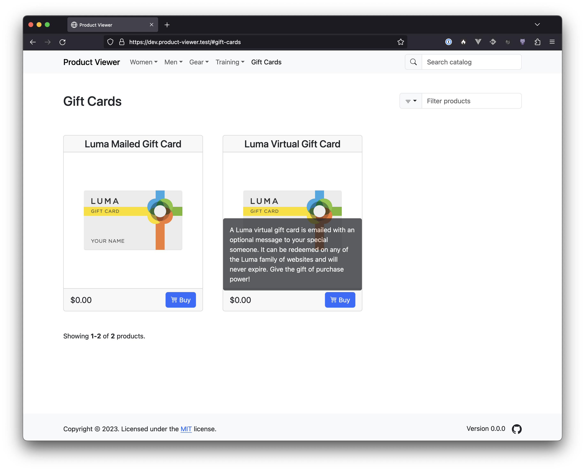

# React Product Viewer
by Joseph Leedy

React Product Viewer is a simple utility application built by Joseph Leedy for 
the purpose of learning how to build Web applications using TypeScript and
React. It is built on top of [Vite] and uses [Bootstrap] 5 for its user 
interface. This application is also fully unit tested using [Vitest].

React Product Viewer provides a window into an e-commerce store built on the
Magento Open Source, Adobe Commerce or MAGE-OS platform. It renders the 
configured store's products in a searchable and filterable grid. (**Note:**
Complex product types, including configurable, grouped and bundled products, as
well as custom product types, are not supported at this time.)

## Disclaimer

**HERE BE DRAGONS!**

This application is not intended, nor it is fit, for use in a production
environment. The code contained herein is in an amateur state which is
constantly evolving and may be unstable or be of inconsistent quality.

## Requirements

- [Node.js] version 18, 19, 20 or 21 (tested with versions 18 and 20)
- [NPM] version 10

## Installation

1. Clone this project locally from the [GitHub repository][repo] using this
command:

       git clone https://github.com/JosephLeedy/react-product-viewer.git
2. Install its dependencies with this command:
    
       cd react-product-viewer && npm install
3. Run this command to start the application in development mode:

       npm run dev

## Configuration

The following settings _must_ be configured in order for the application to
function properly:

| Name                               | Default | Description                                                                                          |
|------------------------------------|---------|------------------------------------------------------------------------------------------------------|
| VITE_MAGENTO_BASE_URL              | ""      | Base URL of the connected Magento or Adobe Commerce store                                            |
| VITE_MAGENTO_IMAGE_URL             | ""      | URL where product images are located                                                                 |
| VITE_MAGENTO_PLACEHOLDER_IMAGE_URL | ""      | URL where the product placeholder image is located                                                   |
| VITE_MAGENTO_URI_SUFFIX            | ""      | String to append to Magento Catalog URLs                                                             |
| VITE_BACKEND_URL                   | ""      | URL of the backend application used to fetch data from the connected Magento or Adobe Commerce store |

Configuration can be set `.env`, `.env.local`, `.env.development` or
`.env.production` depending on which environment you are configuring. (See
Vite's [.env documentation][vite-docs-env] for more information.)

Example configuration is provided in `.env.dist`.

## Usage

Once the application is running, visit `http://localhost:5173` to use the
application.

## Support

Because this is a learning project which is not intended for real-world usage,
no support is offered at this time. If you think that have found a bug, however,
or you'd like to provide feedback or suggestions for improvement, please open a
[GitHub Issue][issues].

## License

This application is licensed under the MIT license. Please see [LICENSE] for
details.

## Changelog

A record of all the changes made to this application can be found in the
[Changelog] document.

## Future Plans

For a list of features that might be added or learning topics which might be
explored in future application revisions, please see the [Phase II][plans]
document.

[LICENSE]: ./LICENSE
[Changelog]: ./CHANGELOG.md
[plans]: ./docs/PhaseII.md
[repo]: https://github.com/JosephLeedy/react-product-viewer
[issues]: https://github.com/JosephLeedy/react-product-viewer/issues
[Vite]: https://vitejs.dev/
[vite-docs-env]: https://vitejs.dev/guide/env-and-mode#env-files
[Vitest]: https://vitest.dev/
[Bootstrap]: https://getbootstrap.com/
[Node.js]: https://nodejs.org/
[NPM]: https://www.npmjs.com/package/npm
